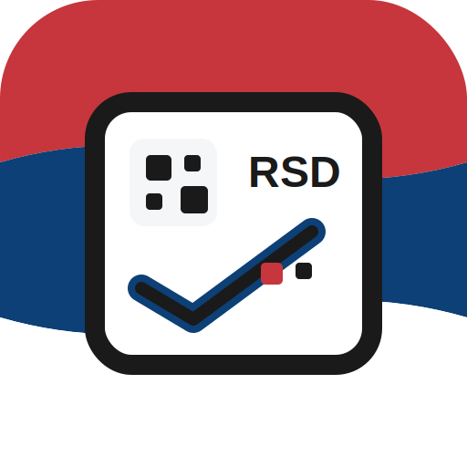
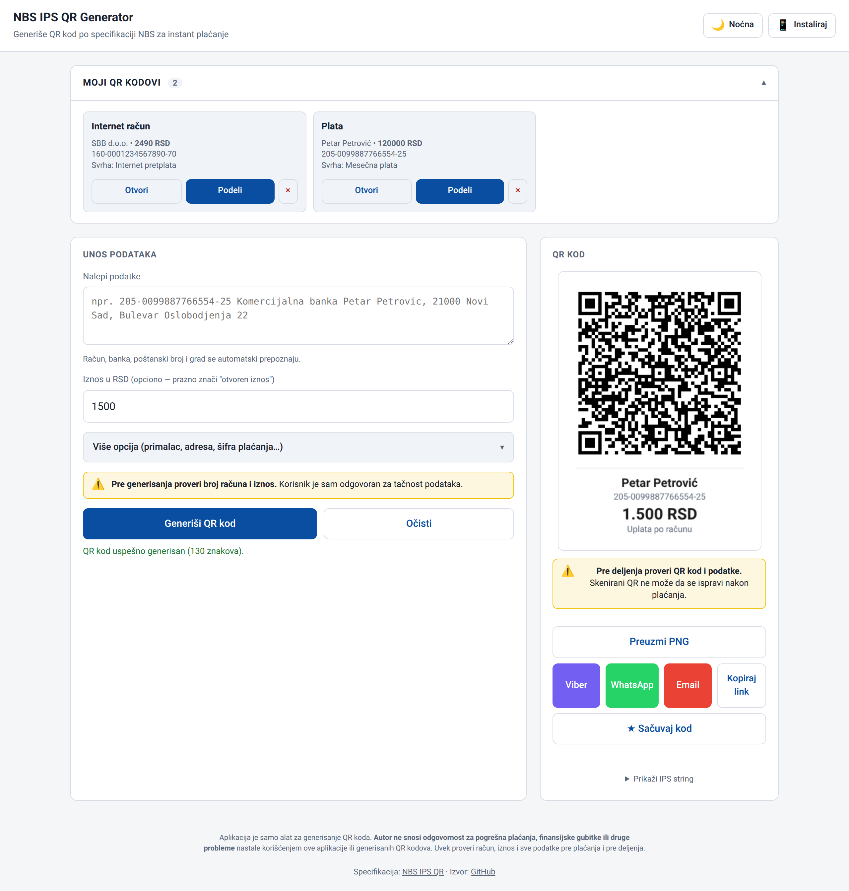
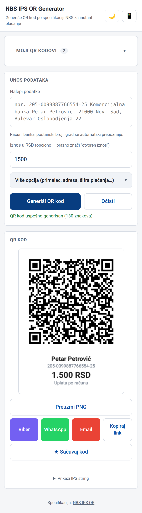

<p align="center">
  
</p>

<h1 align="center">QR Pay — NBS IPS QR Generator</h1>

<p align="center">
  <a href="https://acosonic.github.io/qrpay/"></a>
  
  
  
</p>

Web aplikacija za generisanje **NBS IPS QR koda** (Narodna banka Srbije, instant plaćanje) sa podrškom za deljenje preko Viber-a, WhatsApp-a, email-a i Web Share API-ja. Radi offline kao PWA, podaci o sačuvanim QR kodovima se čuvaju lokalno u browseru.

> NBS IPS QR generator with offline PWA support, native share, and saved-codes wallet. Pure HTML/CSS/JS, no build step.

## Screenshots

<table>
  <tr>
    <td align="center" valign="top" width="65%">
      <strong>Desktop</strong><br>
      
    </td>
    <td align="center" valign="top" width="35%">
      <strong>Mobile</strong><br>
      
    </td>
  </tr>
</table>

## Funkcionalnost

- **Pametan parser** — nalepi tekst tipa `160550010064176439 Marko Markovic, Knez Mihailova 5, 11000 Beograd` ili `205-0099887766554-25 Banca Intesa Petar Petrovic, 21000 Novi Sad` → automatski prepozna račun (sa ili bez crtica), banku, poštanski broj, grad
- **Baza od 1138 srpskih poštanskih brojeva** za validaciju gradova
- **Validacija** — MOD 97-10 checksum računa, NBS IPS format spec
- **PWA** — instalira se na home screen (iOS/Android/Desktop), radi offline, native install prompt
- **Crno-bela tema** sa persistencijom (localStorage)
- **PNG sa caption-om** — generisani QR sadrži ime primaoca, račun, iznos, svrhu pisane ispod QR-a
- **Auto-generate link** — share URL koji kad primalac otvori, automatski popuni formu i generiše QR (`#hash` params, payment data ne ide na server)
- **Sharing** — Viber, WhatsApp, Email, native share sheet, clipboard slike/link-a, PNG download
- **Moji QR kodovi** — sačuvaj često korišćene kodove u localStorage, sa per-stavku share/open/delete

## Tech stack

- Vanilla HTML/CSS/JS, bez build step-a
- [`qrcode-generator`](https://github.com/kazuhikoarase/qrcode-generator) v1.4.4 (cdnjs) — QR encoding sa UTF-8 byte mode-om
- Service worker (network-first za HTML, stale-while-revalidate za assete)
- Web Share API Level 2 (file sharing), Clipboard API, localStorage

## Struktura

```
index.html               # SPA — UI + sva logika
postal-codes.js          # { "11000": "Beograd", ... } lookup map (1138 unosa)
manifest.json            # PWA manifest
service-worker.js        # Offline cache + SW message handling
.htaccess                # Apache: SW no-cache, security headers
icon-source.svg          # Master ikonica (jedini ručno-edit fajl)
favicon.svg              # Kopija icon-source za browser tabove
favicon.ico              # Multi-size 16+32+96 za stare browsere
favicon-96x96.png        # PNG fallback
apple-touch-icon.png     # 180×180 za iOS home screen
web-app-manifest-192x192.png   # Android home screen
web-app-manifest-512x512.png   # PWA splash + OG/Twitter card
ikonica.md               # Dokumentacija dizajna i regenerisanja ikonice
```

## Lokalno pokretanje

Bilo koji static HTTP server radi:

```bash
python3 -m http.server 8765
# → http://localhost:8765
```

Service worker traži HTTPS ili localhost, tako da `file://` neće raditi za PWA features.

## Deploy

App je static — radi na bilo kom HTTP serveru (Apache, Nginx, GitHub Pages, Netlify, Vercel). Putanje su relativne tako da radi i u podfolderu.

Trenutno se deploy-uje na `https://acosonic.com/qrcode/`.

## Reference

- [NBS IPS QR specifikacija](https://ips.nbs.rs/en/qr-validacija-generisanje)
- [ArtBIT/ips-qr-code](https://github.com/ArtBIT/ips-qr-code) — referentna IPS schema i field redosled
- [dusnm/nbs-ips-qr](https://github.com/dusnm/nbs-ips-qr) — algoritam za proširenje računa i MOD 97-10
- [stefancode/Srbija-gradovi](https://github.com/stefancode/Srbija-gradovi) — baza poštanskih brojeva

## Licence

MIT
